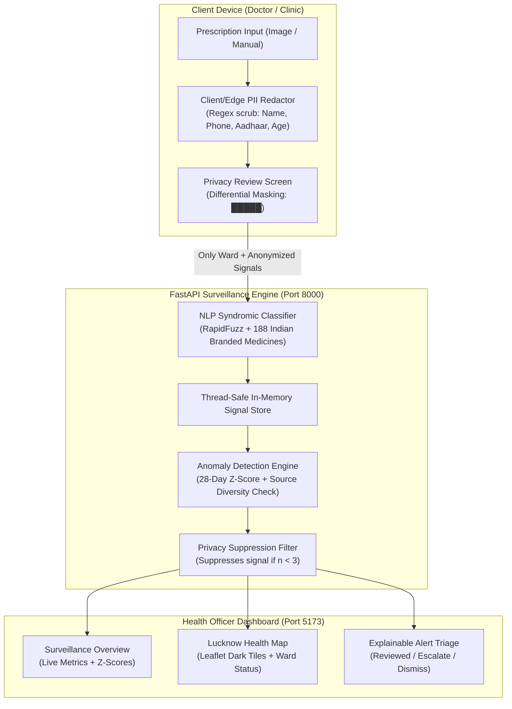

# 🛰️ NABZ AI — Health Signal Radar

> **Privacy-Preserving Early Syndromic Disease Surveillance System**  
> *Transforming anonymized local prescription data into actionable early warning signals for public health officials.*

---

## 🎯 Overview

**NABZ AI** acts as an early-warning radar for municipal health departments. By capturing outpatient prescriptions at clinics and pharmacies, stripping all Personally Identifiable Information (PII) on-device, and mapping pharmaceutical patterns into syndromic disease clusters, NABZ identifies statistical anomalies days or weeks before hospital admissions surge.

* **Demo Focus Area:** Lucknow, Uttar Pradesh, India
* **Current Hot Zone:** Aliganj Ward 3 (Gastrointestinal surge detected: ORS + Ofloxacin + Ondansetron pattern)
* **Status:** All 6 Development Phases Complete & Operational

---

## 🏗️ System Architecture



---

## 🚀 Quickstart

### Prerequisites
- Python 3.10+
- Node.js 18+ & npm

### 1. Start the Backend (FastAPI)
```bash
cd backend
pip install -r requirements.txt
python -m uvicorn app.main:app --host 127.0.0.1 --port 8000 --reload
```
* Interactive API Documentation available at: `http://127.0.0.1:8000/docs`

### 2. Start the Frontend (Vite + React)
```bash
cd frontend
npm install
npm run dev
```
* App available at: `http://localhost:5173/`

---

## 🧪 Testing

The backend includes a comprehensive synthetic prescription test suite:
```bash
cd backend
python -m pytest
```
* **27/27 tests passing**: covers PII scrubbing patterns, RapidFuzz syndromic mapping, z-score calculation, and full API endpoint integration.

---

## 🎬 3-Minute Demo Walkthrough

1. **Dashboard Overview (`/`)**:
   - Health officer views 96 daily signals across 8 Lucknow wards.
   - 1 AMBER alert and 2 WATCH alerts flagged.
   - Disclaimer clearly visible: *"NABZ supports investigation. It does not diagnose individuals or declare an outbreak."*

2. **Role Switcher (`/login`)**:
   - Click "Doctor Demo" to switch to the clinical capture interface.

3. **Prescription Capture (`/capture`)**:
   - Choose the "Gastroenteritis Cluster" preset or upload an image.
   - Doctor sees automatic ward attribution: `Aliganj Ward 3, Lucknow`.
   - Click **Run Privacy & Clinical Analysis**.

4. **Privacy Review Screen (`/privacy`)**:
   - Demonstrates strict PII redacting: patient names, phone numbers, and addresses are masked with `█████`.
   - Audit checklist confirms: *No patient names leave device*, *No phone numbers stored*, *Only syndromic categories transmitted*.
   - Click **Transmit Anonymous Signal**.

5. **Live Health Map (`/map`)**:
   - Switch back to Admin role.
   - Aliganj Ward 3 pulses in **AMBER** on the interactive Leaflet map.
   - Filter by disease category: *Gastrointestinal*, *Febrile / Viral*, *Respiratory*.

6. **Explainable Alert Details (`/alerts/1`)**:
   - View the statistical evidence breakdown: Z-score **3.4**, multi-source validation (3 clinics, 2 pharmacies, 1 lab).
   - Admin takes triage action: **Reviewed**, **Escalate to Field Team**, or **Dismiss with Note**.

---

## 🔒 Privacy & Safety Guarantees

| Feature | Implementation | Guarantee |
|---|---|---|
| **Zero Raw Storage** | PII Scrubber removes all identifying markers immediately. | Raw images and patient names never persist to disk or database. |
| **Privacy Suppression** | `count < 3` suppression rule. | No alert or public signal generated if fewer than 3 independent reports exist. |
| **Source Diversity** | Requires signals across multiple clinics/pharmacies. | Prevents rogue clinic bias or false alarm triggers. |
| **Human-in-the-Loop** | Alert tiers: NORMAL, WATCH, AMBER (No automatic RED). | Only public health officers can declare an emergency. |

---

## 📊 Summary of Completed Phases

- [x] **Phase 0 — Foundation**: React Router 7, Vite, Lucide icons, Design system, `.env` structure.
- [x] **Phase 1 — Interactive Map**: Leaflet + Stadia dark tiles, Lucknow ward centroids, dynamic status markers.
- [x] **Phase 2 — Doctor Ingestion & Privacy**: Upload flow, camera capture, side-by-side PII scrubbing review.
- [x] **Phase 3 — NLP & Syndromic Engine**: 188 Indian medicine dictionary, RapidFuzz token matching, combination rules.
- [x] **Phase 4 — Anomaly Detection & Alerts**: 28-day baseline z-score algorithm, explainability engine, admin triage workflow.
- [x] **Phase 5 — Polish, Demo, & Packaging**: Error/loading states, responsive design, end-to-end integration, full documentation.

---

## 🌐 Production Deployment

- **Frontend**: Deploy `frontend/` to **Vercel** or **Netlify** (`npm run build`). Set environment variable `VITE_API_URL`.
- **Backend**: Deploy `backend/` to **Render**, **Railway**, or **AWS ECS** using `uvicorn app.main:app --host 0.0.0.0 --port $PORT`.
